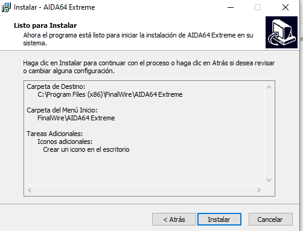
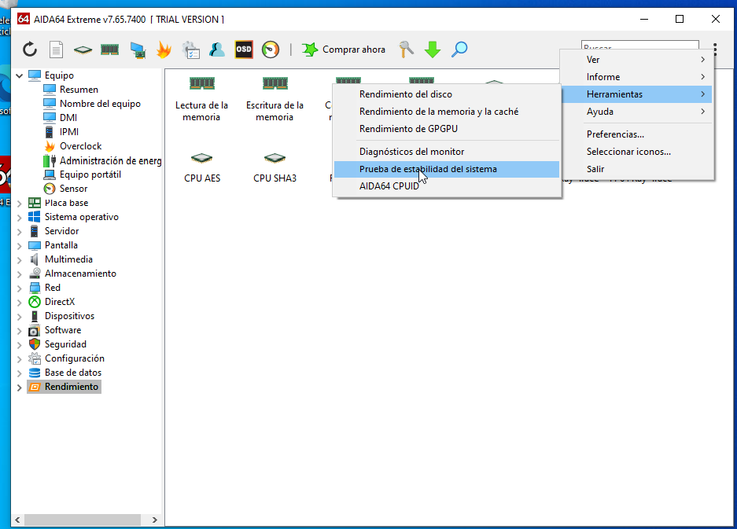
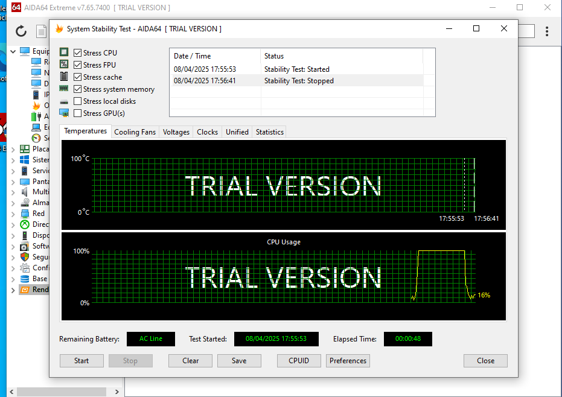

# AIDA64 Extreme - Mini Guía

## Introducción

AIDA64 Extreme es una suite de diagnóstico y benchmarking para Windows. Muestra información completa del hardware y realiza pruebas de rendimiento y estabilidad.

## Descarga e Instalación

1. Ir a [https://www.aida64.com/downloads](https://www.aida64.com/downloads)
2. Descargar la edición Extreme.
3. Instalar el programa con el instalador descargado.

## Uso Básico

1. Abre AIDA64.
2. En el menú lateral, explora:
   - **Computer > Summary**: resumen del sistema.
   - **Motherboard, CPU, GPU**: info técnica.
3. Para test de estrés:
   - Ir a Tools > System Stability Test.
   - Marcar CPU, FPU, cache y memoria, luego clic en “Start”.

### Interpretación

- Observa las gráficas de temperatura, uso, voltajes.
- Ideal para ver si el sistema es estable bajo carga prolongada.

