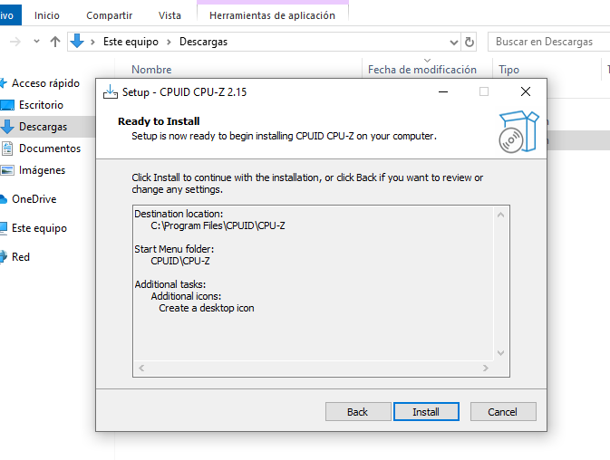
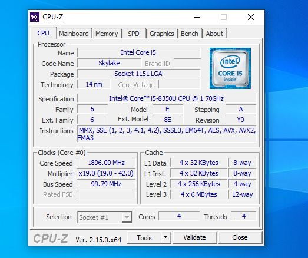
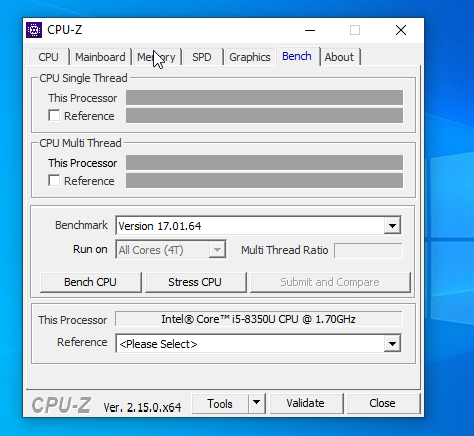

# CPU-Z - Mini Guía

## Introducción

CPU-Z es una herramienta gratuita que muestra información técnica detallada sobre tu CPU, placa base, RAM y tarjeta gráfica.

## Descarga e Instalación

1. Ir a [https://www.cpuid.com/softwares/cpu-z.html](https://www.cpuid.com/softwares/cpu-z.html)
2. Descargar la versión ZIP o instalador.
3. Ejecutar cpuz.exe.

## Uso Básico

1. Abre CPU-Z.
2. Navega por las pestañas:
   - **CPU**: modelo, frecuencia, núcleos, etc.
   - **Memory**: tipo, velocidad, canales.
   - **Mainboard**: modelo de placa madre.

### Interpretación

- Información útil para conocer especificaciones reales.
- En la pestaña Bench, puedes correr un benchmark de CPU básico y compararlo.

