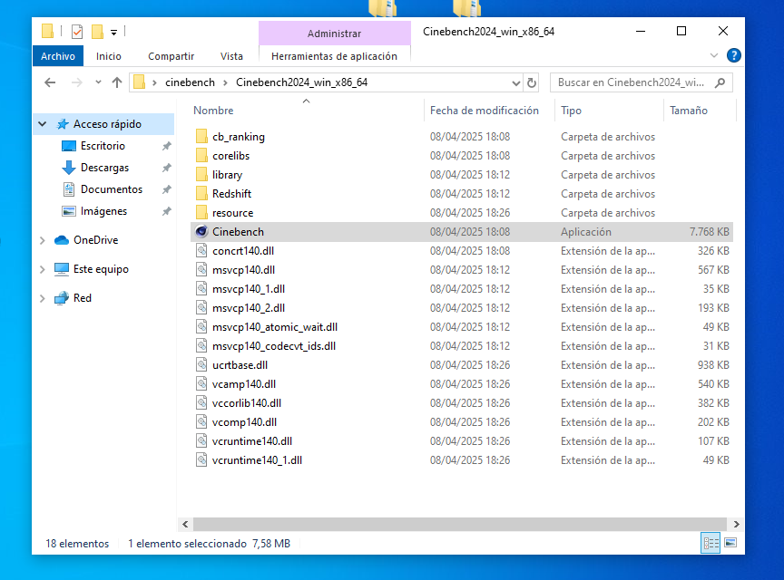
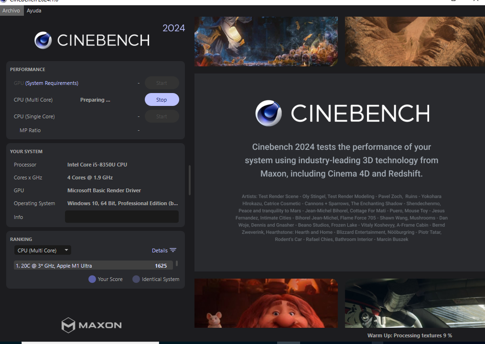

# Cinebench - Mini Guía

## Introducción

Cinebench es una herramienta de benchmarking desarrollada por Maxon. Evalúa el rendimiento del CPU y GPU (OpenGL) utilizando pruebas de renderizado realistas basadas en Cinema 4D.

## Descarga e Instalación

1. Ir al sitio oficial: [https://www.maxon.net/en/cinebench](https://www.maxon.net/en/cinebench)
2. Descargar la versión para Windows o macOS.
3. Extraer el archivo ZIP y ejecutar el archivo Cinebench.exe.

## Uso Básico

1. Ejecuta el programa.
2. Selecciona el tipo de test:
   - CPU (Multi Core)
   - CPU (Single Core)

3. Haz clic en “Start” para iniciar el test.

### Interpretación

- Se muestra una puntuación en puntos.
- Cuanto más alto, mejor rendimiento.
- Puedes comparar tu puntuación con otros CPUs del ranking que aparece en la misma ventana.
