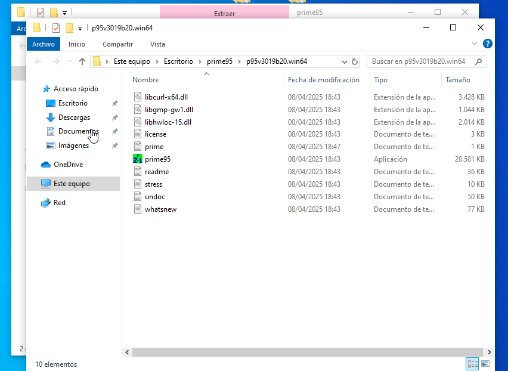
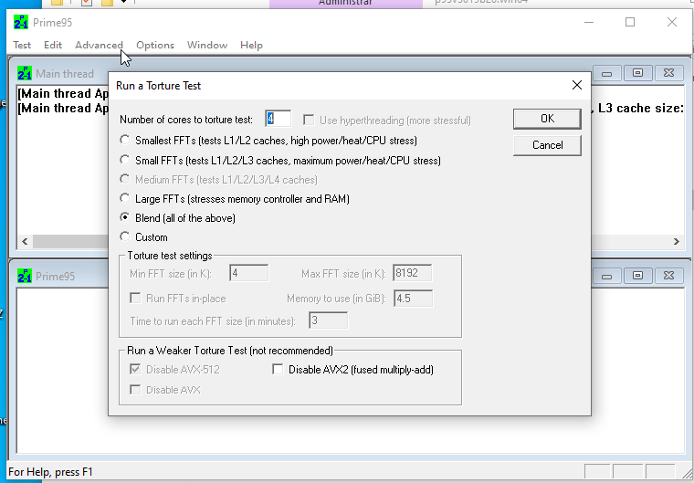
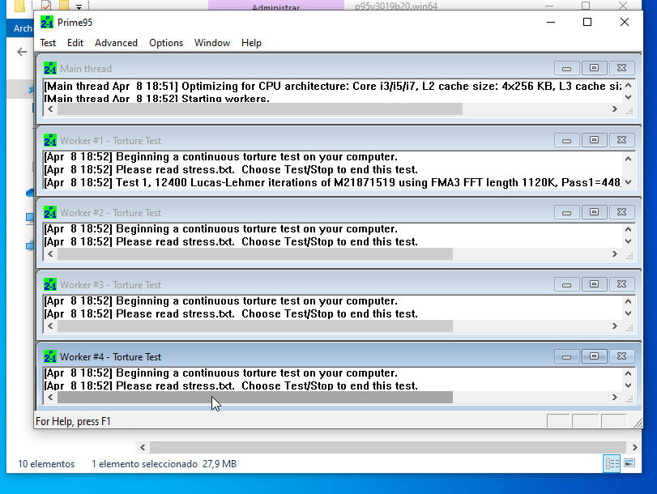

# Prime95 - Mini Guía

## Introducción

Prime95 es una herramienta muy conocida por su uso en pruebas de **estrés de CPU y RAM**, usada comúnmente para comprobar la estabilidad del sistema en overclocking.

## Descarga e Instalación

1. Ir a [https://www.mersenne.org/download/](https://www.mersenne.org/download/)
2. Descargar la versión para tu sistema operativo.
3. Extraer el ZIP y ejecutar prime95.exe.

## Uso Básico

1. Ejecuta Prime95.
2. Selecciona `Just Stress Testing`.

3. Elige el tipo de test:
   - **Small FFTs**: máximo estrés de CPU.
   - **Blend**: estrés de CPU + memoria.
   - **Large FFTs**: memoria más que CPU.

4. Haz clic en “OK”.

### Interpretación

- Si el sistema no se congela o da errores en varias horas, es estable.
- Errores o cierres indican problemas en la CPU, RAM o configuración de voltaje.

